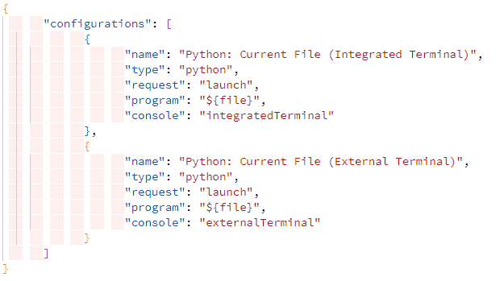

# Indent White Space

Enlarge the rendering of indentation spaces.



For High Contract Themes the decoration is a double border under the enlargement.

**Known Problem**:  
When using command **Preferences: Color Theme** (`ctrl+k ctrl+t`, `workbench.action.selectTheme`) the `settings.json` file is not updated with the new theme name when you use the Up/Down Arrow keys. The decorator style is not changed when you switch between Ligh/Dark and High Contrast themes. When you select a theme the decorator style is changed.  
The reason is that for the current version of VSC (v1.74) it is not possible to define a decorator that has different styles for Light/Dark and High Contrast Themes. A High Contrast Theme uses the `light` or `dark` settings of the decorator.

## Settings

* `indentWhitespace.space.enlargement` : number ∈ ℕ (>= 0), the number of spaces to enlarge each indent space, if `0` there is no decoration, (default: `1`)
* `indentWhitespace.space.positionDecorator` : [ `"before"` | `"after"` ] Position of the indent space decorator, (default: `"after"`)

The extension defines the following Theme Color:

* `indentWhitespace.space.enlargement` : Color for the indent space decoration.

A [Theme Color can be customized](https://code.visualstudio.com/docs/getstarted/themes#_customizing-a-color-theme) in your `settings.json`:

Change the decoration color for all Monokai Themes:

```json
  "workbench.colorCustomizations": {
      "[Monokai*]": {
          "indentWhitespace.space.enlargement": "#00ff0020"
      }
  }
```